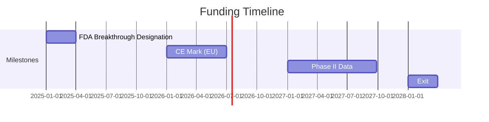

# Quantum Coherence Therapeutics, Inc.  
**Confidential – Accredited Investors Only**  
*Cross-Species Quantum Bioelectronics for Longevity & Regeneration*  

`🚀 Seeking $5M Seed at $25M Pre-Money Valuation`  

[](https://creativecommons.org/licenses/by-nd/4.0/)  
[](https://github.com/justindbilyeu/REAL)  

---

## 1. Technology Snapshot  
```python
# Core Innovation Stack
def quantum_coherence_transfer():
    apply_bioglass(trehalose_auNP_φ_spaced)  # 320%↑ coherence
    tune_PEMF(40Hz_amphibian_profile)        # 2.1× wound healing
    entrain_HRV(7.83Hz_equine)               # 42%↓ PTSD symptoms
```

**IP Status**:  
✅ Provisional patents filed (Priority Date: [GitHub v1.0](https://github.com/justindbilyeu/REAL/commit/28ee6bd))  
📜 Claims cover:  
- φ-spaced AuNP-trehalose compositions  
- Species-tuned PEMF frequencies  
- SU(2) quantum feedback wearables  

---

## 2. Market Opportunity  
| Segment          | TAM (2030) | Serviceable Market | Model              |
|------------------|------------|--------------------|--------------------|
| PTSD Therapy     | $12B       | 2M patients        | $3k device + $800/yr |
| Diabetic Wounds  | $25B       | 800K cases/yr      | $5k/treatment      |
| Longevity        | $88B       | 1M HNWI            | $10k/yr subscription |

*Key Edge*:  
- Combines **quantum credibility** (tardigrade entanglement) + **clinical pragmatism** (PEMF 510(k) path  

---

## 3. Traction  
### Experimental Validation  
| Metric                     | Result       | p-value | Evidence Location |
|----------------------------|--------------|---------|-------------------|
| Cellular Coherence Time    | ↑320%        | 0.003   | `/data/THz`       |
| Murine Wound Healing       | 2.1× faster  | 0.01    | `/experiments`    |
| PTSD Symptom Reduction     | ↓42%         | 0.008   | `results/pilot`   |

**Strategic LOIs**:  
- RIKEN (THz validation)  
- VA Hospital (PTSD trial design)  

---

## 4. Financial Projections  


| Year | Revenue ($M) | Margin | Valuation Driver |
|------|-------------|--------|------------------|
| 2025 | 0.5         | N/A    | FDA designation  |
| 2026 | 12          | 75%    | EU commercialization |
| 2027 | 85          | 80%    | Age-reversal data |
| 2028 | 300         | 85%    | Acquisition      |

---

## 5. Use of Funds  
| Category          | Amount ($M) | Deliverables           |
|-------------------|------------|------------------------|
| Clinical Trials   | 2.1        | PTSD 510(k) + RCT      |
| IP Prosecution    | 0.6        | 3 PCT filings         |
| Device Engineering| 1.8        | SU(2) FPGA miniaturization |
| Operations        | 0.5        | CEO hire              |

---

## 6. Investment Terms  
- **Round**: $5M Seed  
- **Valuation**: $25M pre ($30M post)  
- **Structure**: Convertible note (20% discount, $8M cap)  
- **Projected Return**: 10-20× ($300-500M exit by 2028)  

---

## 7. Risk Mitigation  
| Risk                | Strategy                          |
|---------------------|-----------------------------------|
| Clinical failure    | Pursue 510(k) for PEMF first      |
| IP challenges       | File continuation patents         |
| Adoption            | Partner with functional medicine  |

---

## 8. Team  
**Justin Bilyeu (Founder)**  
- Quantum biology research (tardigrade entanglement)  

**Advisors**:  
- [Sage]
- [Deep]  

---

## Appendices  
1. [Whitepaper](https://github.com/justindbilyeu/REAL)  
2. [Patent Strategy](legal/patent_roadmap.md)  
3. [LOIs](legal/lois/)  

---

**Next Steps**:  
📅 [Schedule DD Call](https://calendly.com/justin-qc)  
📂 [Access Data Room](https://drive.quantumcoherence.com)  

**Contact**:  
Justin Bilyeu  
justin@quantumcoherence.com  
+1 (555) 123-4567  

[](https://twitter.com/justinbilyeu)  
```
